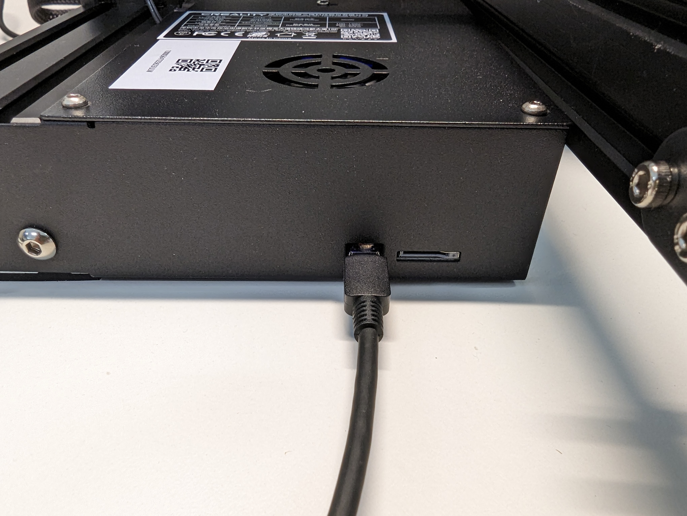

# serial_to_printer
Connecting to 3D printer through python script

## Requirements
Python 3.11+

## Set up

1. Connect the computer and 3D printer with a USB cable. A micro-USB port can be found at the front of the printer.

    

2. Ensure that the 3D printer is powered. Note that when the USB cable is connected the screen will turn on, but this is not enough to power the stepper motors so the printer will not move.

## Running the code
[Windows instructions](#windows)

[Mac instructions](#mac)

### Windows
1. Check what port the printer is connected to through device manager.
1. Set the `PORT` and `FILE_NAME` constants within `connect_to_3d_printer.py`. You shouldn't need to change the `BAUD_RATE`.
2. run `connect_to_3d_printer.py`.

### Mac
1. Check what port the printer is connected to via the terminal.
    ```bash
    ls /dev/tty*
    ```
2. Set the `PORT` and `FILE_NAME` constants within `connect_to_3d_printer.py`. You shouldn't need to change the `BAUD_RATE`.
3. run `connect_to_3d_printer.py`.

## Gcode reference
https://marlinfw.org/meta/gcode/